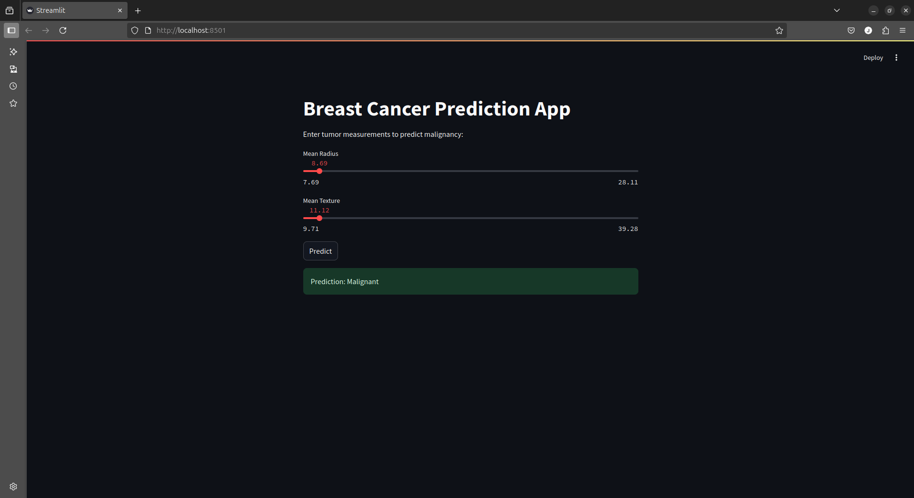
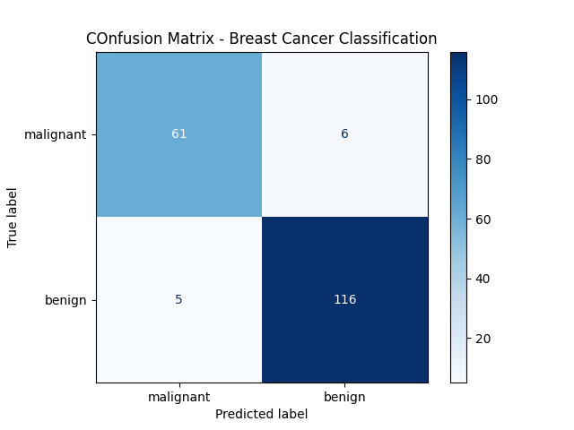
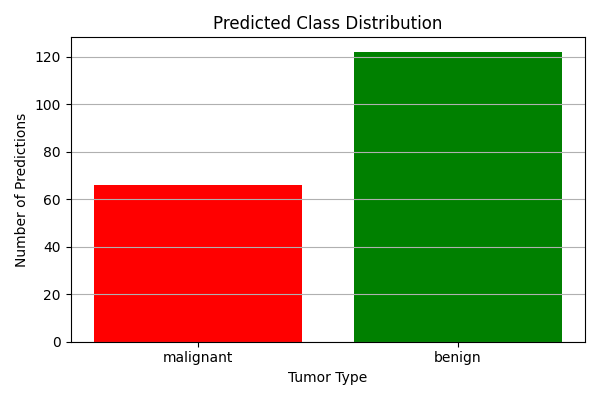

# 🧬 Breast Cancer Classifier

A machine learning web app that predicts whether a tumor is **malignant or benign** using the **Breast Cancer Wisconsin Diagnostic Dataset**. Built with **Scikit-learn**, **Streamlit**, and **Python**, and deployed to the cloud for public access.

## 🚀 Live Demo

👉 [Try the live app here](https://breastcancerclassifierdemo.streamlit.app/)

## 🎯 Features

- Predicts tumor malignancy from feature inputs like mean radius, texture, and symmetry
- Interactive sliders for custom input
- Trained on real-world medical data (569 records, 30 features)
- Displays prediction instantly with dynamic UI
- Visualizes results with confusion matrix and accuracy score
- Easy to run locally or explore on the web

## 🛠 Tech Stack

- Python 3
- Scikit-learn
- Streamlit
- NumPy
- Matplotlib (optional for visualizations)

## 📂 Dataset

- Breast Cancer Wisconsin (Diagnostic) Dataset  
- Built-in dataset available via `sklearn.datasets.load_breast_cancer()`

## 📸 Screenshots

| Prediction Interface | Confusion Matrix                   | Bar Chart                                      |
|----------------------|------------------------------------|------------------------------------------------|
|  |  |  |

## 🧪 Getting Started Locally

```bash
# Clone the repo
git clone https://github.com/justkimtai/breast-cancer-classifier.git
cd breast-cancer-classifier

# Create virtual environment (optional)
python3 -m venv venv
source venv/bin/activate

# Install dependencies
pip install -r requirements.txt

# Run app
streamlit run app.py
```

## 🤝 Credits

This project was inspired by [DigitalOcean tutorials](https://www.digitalocean.com/community/tutorials) and built as part of my machine learning learning journey.

## 📩 Contact

Feel free to connect with me on [X (Twitter)](https://x.com/justkimtai) or [email](mailto:justkimtai@gmail.com) me for collaboration, freelance work, or opportunities!
